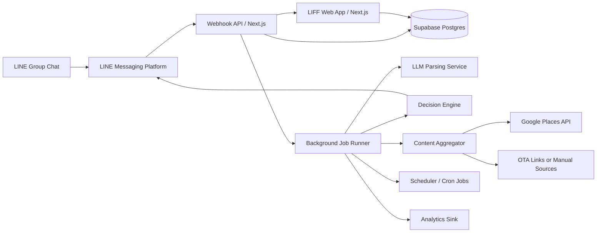

# TravelSync AI MVP System Design

> Version: 1.0  
> Date: 2026-04-03  
> Status: Proposed  
> Source: Derived from `prd-travel-sync-ai.md`

---

## 1. Purpose

This document translates the product requirements in the PRD into an implementable MVP system design. It focuses on the smallest architecture that can reliably deliver the core value loop:

1. Organizer adds the LINE bot to a group.
2. The system parses travel-relevant chat messages.
3. The organizer or AI starts a decision workflow.
4. Members vote through Flex Messages.
5. The result is persisted and reflected in the LIFF dashboard.

The design optimizes for:

- Fast delivery by a small team
- Low operational complexity
- Correctness and traceability for trip state
- Clear upgrade paths when volume and product scope grow

---

## 2. Scope

### In Scope for MVP

- LINE bot onboarding and webhook handling
- Semantic parsing of new group messages only
- Three-stage trip board: To-Do, Pending, Confirmed
- Organizer commands: `/start`, `/vote`, `/status`, `/nudge`, `/add`, `/help`
- Flex Message decision cards with per-user voting
- LIFF dashboard for board and basic itinerary/status view
- Scheduled reminders, vote deadline handling, stale-item reminders
- Analytics and operational telemetry

### Out of Scope for MVP

- Native mobile app
- Direct booking or payment processing
- Full itinerary export, bill splitting, flight monitoring
- Multi-platform chat support outside LINE
- Historical backfill of pre-install group messages

---

## 3. Design Principles

1. Acknowledge LINE fast, process intelligently in the background.
2. Treat trip state as the system of record, not the chat transcript.
3. Store structured entities and decisions; retain raw messages only briefly.
4. Keep the runtime mostly monolithic for speed, but separate concerns internally.
5. Build every user-facing action to degrade gracefully when the LLM or external APIs are slow.

---

## 4. Target Architecture

### 4.1 Logical View



### 4.2 Deployment View

The MVP uses a single Next.js codebase deployed to Vercel with Supabase as the primary state store.

- Next.js app
  - LINE webhook endpoint
  - Bot command handlers
  - LIFF web app pages
  - Internal API routes
- Supabase
  - PostgreSQL database
  - Row-level security for LIFF reads and writes
  - Realtime subscriptions for live board updates
- Background execution
  - Vercel background execution for async event processing
  - Cron-driven recovery and scheduled jobs for nudges and deadlines
- External services
  - LINE Messaging API and LIFF SDK
  - OpenAI or Claude API for semantic parsing
  - Google Places API for hotel and place metadata
  - Cloudinary for cached thumbnails used in Flex Messages

### 4.3 Why This Shape

This architecture satisfies the main technical tension in the PRD:

- LINE requires webhook acknowledgment in under 1 second.
- LLM parsing and place lookups cannot be relied on to complete in under 1 second.

Therefore, webhook ingestion and business processing are separated:

- The webhook layer validates, records, and acknowledges immediately.
- Background workers process parsing, voting logic, reminders, and outbound messages.

---

## 5. Core Runtime Flows

### 5.1 Group Join and Trip Initialization

1. Bot is added to a LINE group.
2. LINE sends a `join` event to the webhook.
3. Webhook verifies the signature, stores the event, returns `200 OK` immediately.
4. Background processor creates a `group` record if needed.
5. System sends a welcome message with quick-start guidance.
6. Organizer runs `/start Osaka 7/15-7/20`.
7. Command handler creates a `trip` record, sets destination and date range, and returns a confirmation card.

### 5.2 Message Parsing Pipeline

1. A group message arrives from LINE.
2. Webhook stores a normalized event envelope and acknowledges immediately.
3. Background processor loads current group and active trip context.
4. Relevance filter classifies the message as either travel-relevant or ignorable.
5. If relevant, the parser sends a structured prompt to the LLM.
6. Structured result is validated against schema.
7. Extracted entities are written to the database.
8. Conflict detector checks whether the new entities contradict existing trip facts.
9. If a new action item is implied, a board item is created or updated.
10. If a conflict exists, a Pending item is created for organizer resolution or voting.

### 5.3 Vote Creation and Completion

1. Organizer runs `/vote hotel` or taps a LIFF action.
2. System resolves the target board item.
3. Option generator fetches candidate places and normalizes fields.
4. Flex Message carousel is generated with 3 to 5 options.
5. Board item moves from To-Do to Pending.
6. Votes are recorded per member.
7. Real-time counts update in the database and LIFF view.
8. Vote closes when majority is reached or deadline expires.
9. Winner is written to the item as the confirmed selection.
10. Bot announces the result in chat and the board item moves to Confirmed.

### 5.4 Reminder Flow

1. Scheduler scans for open votes nearing deadline or stale To-Do items.
2. System computes non-responders or overdue items.
3. Nudge messages are sent only if frequency limits allow.
4. Events are logged for analytics and spam monitoring.

---

## 6. Major Components

### 6.1 Webhook Ingestion Layer

Responsibilities:

- Verify LINE channel signature
- Normalize incoming LINE events
- Persist the event envelope durably
- Return `200 OK` within 1 second
- Trigger async processing

Key decisions:

- Never call the LLM directly in the synchronous webhook path.
- Never depend on external place APIs in the synchronous webhook path.
- Persist first, process second.

Failure handling:

- If async processing does not start, a retry sweeper picks up unprocessed events.
- Duplicate LINE events are deduplicated using the platform event identifier plus group scope.

### 6.2 Command Router

Responsibilities:

- Identify slash commands from message content
- Validate group and organizer context
- Route to command-specific handlers
- Return either immediate response or deferred follow-up

Supported MVP commands:

- `/start`
- `/vote`
- `/status`
- `/nudge`
- `/add`
- `/help`

Command strategy:

- Cheap commands like `/help` and `/status` should usually complete synchronously.
- Expensive commands like `/vote hotel` may acknowledge quickly and then send a follow-up message once options are built.

### 6.3 Conversation Parsing Service

Responsibilities:

- Filter irrelevant chatter
- Extract travel entities from zh-TW and mixed Chinese-English text
- Resolve references using recent group context
- Detect contradictions and low-confidence output

Pipeline steps:

1. Text normalization
2. Lightweight relevance classification
3. Context assembly from active trip and recent parsed facts
4. LLM structured extraction
5. Confidence scoring and validation
6. Conflict and action-item generation

Model behavior requirements:

- Output strict JSON
- Return confidence per extracted entity
- Explicitly report `irrelevant` when the message should be ignored
- Prefer no extraction over speculative extraction

MVP simplifications:

- Use recent structured context instead of long raw chat history
- Do not attempt multilingual extraction beyond Chinese-English mix
- Do not store full raw message history longer than 7 days

### 6.4 Trip State Engine

Responsibilities:

- Maintain authoritative trip, board, and decision state
- Apply state transitions safely
- Prevent inconsistent item or vote updates

Primary state machine:

- `todo` -> `pending` -> `confirmed`
- `pending` can remain open, extend deadline, or revert to `todo` if cancelled

Rules:

- Only one active vote per board item
- Only one active trip per group in MVP
- Organizer override is allowed on unresolved conflicts and tied votes

### 6.5 Decision and Option Service

Responsibilities:

- Generate hotel, restaurant, or activity candidate sets
- Normalize heterogeneous place data
- Build Flex Message payloads

Inputs:

- Target item type
- Trip destination and dates
- Budget or preference entities if available
- Group preferences such as cuisine or area avoidance

Outputs:

- Ranked option list with name, image, rating, price band, distance, and link
- Flex Message payload with vote actions

MVP approach:

- Use Google Places as the default metadata source
- Support optional static link attachment when OTA data is unavailable
- Cache place metadata and thumbnails to reduce cost and latency

### 6.6 Vote Service

Responsibilities:

- Store one active vote per user per decision
- Allow vote changes until closing
- Determine majority and closure state
- Handle ties and deadline extension

Rules:

- A user can have only one current vote per decision.
- A later vote overwrites the earlier vote atomically.
- Majority is computed against current participating group size.
- If tied at deadline, extend by 12 hours and notify the organizer.

### 6.7 LIFF Web App

Pages for MVP:

- Dashboard: board grouped by To-Do, Pending, Confirmed
- Itinerary: basic confirmed-item timeline and summary
- Help: command summary and product explanation

Responsibilities:

- Authenticate using LIFF and LINE Login context
- Resolve which group trip the user is viewing
- Show real-time updates from Supabase
- Offer fallback refresh and retry states

Design requirements:

- Optimized for mobile LINE in-app browser
- First meaningful load under 2 seconds on 4G
- Large touch targets and zh-TW-first content

### 6.8 Scheduler and Recovery Jobs

Responsibilities:

- Send stale-item reminders after 48 hours
- Close expired votes
- Trigger tie handling
- Retry failed webhook event processing
- Purge expired raw messages and aged trip data

Job categories:

- Near-real-time retries: recovery of failed async event processing
- Time-based user jobs: nudges and deadline enforcement
- Maintenance jobs: retention and cleanup

---

## 7. Data Model

### 7.1 Primary Entities

| Entity | Purpose |
|--------|---------|
| `line_groups` | One LINE group chat connected to the bot |
| `group_members` | Membership snapshot for each group |
| `trips` | Active or historical trip context for a group |
| `trip_items` | Board items across To-Do, Pending, Confirmed |
| `trip_item_options` | Candidate options for a decision item |
| `votes` | Per-user vote records for a decision |
| `parsed_entities` | Structured facts extracted from chat |
| `line_events` | Durable webhook event log and processing status |
| `raw_messages` | Short-retention normalized chat content |
| `outbound_messages` | Audit and retry state for bot sends |
| `analytics_events` | Product telemetry events |

### 7.2 Suggested Schema

#### `line_groups`

- `id` UUID PK
- `line_group_id` text unique
- `name` text nullable
- `status` enum: `active`, `removed`, `archived`
- `created_at` timestamptz
- `last_seen_at` timestamptz

#### `group_members`

- `id` UUID PK
- `group_id` UUID FK
- `line_user_id` text
- `display_name` text nullable
- `role` enum: `organizer`, `member`
- `joined_at` timestamptz
- `left_at` timestamptz nullable
- unique on `(group_id, line_user_id)`

#### `trips`

- `id` UUID PK
- `group_id` UUID FK
- `title` text nullable
- `destination_name` text
- `destination_place_id` text nullable
- `start_date` date nullable
- `end_date` date nullable
- `status` enum: `draft`, `active`, `completed`, `cancelled`
- `created_by_user_id` text
- `created_at` timestamptz
- `ended_at` timestamptz nullable

#### `trip_items`

- `id` UUID PK
- `trip_id` UUID FK
- `item_type` enum: `hotel`, `restaurant`, `activity`, `transport`, `insurance`, `flight`, `other`
- `title` text
- `description` text nullable
- `stage` enum: `todo`, `pending`, `confirmed`
- `source` enum: `ai`, `command`, `manual`, `system`
- `status_reason` text nullable
- `confirmed_option_id` UUID nullable
- `deadline_at` timestamptz nullable
- `created_at` timestamptz
- `updated_at` timestamptz

#### `trip_item_options`

- `id` UUID PK
- `trip_item_id` UUID FK
- `provider` enum: `google_places`, `ota`, `manual`
- `external_ref` text nullable
- `name` text
- `image_url` text nullable
- `rating` numeric nullable
- `price_level` text nullable
- `distance_meters` integer nullable
- `address` text nullable
- `booking_url` text nullable
- `metadata_json` jsonb
- `created_at` timestamptz

#### `votes`

- `id` UUID PK
- `trip_item_id` UUID FK
- `option_id` UUID FK
- `group_id` UUID FK
- `line_user_id` text
- `cast_at` timestamptz
- unique on `(trip_item_id, line_user_id)`

#### `parsed_entities`

- `id` UUID PK
- `group_id` UUID FK
- `trip_id` UUID FK nullable
- `line_event_id` UUID FK
- `entity_type` enum: `date`, `date_range`, `location`, `flight`, `hotel`, `preference`, `budget`, `constraint`, `conflict`
- `canonical_value` text
- `display_value` text
- `confidence_score` numeric
- `attributes_json` jsonb
- `created_at` timestamptz

#### `line_events`

- `id` UUID PK
- `line_event_uid` text unique
- `group_id` UUID nullable
- `event_type` text
- `payload_json` jsonb
- `processing_status` enum: `pending`, `processing`, `processed`, `failed`
- `failure_reason` text nullable
- `received_at` timestamptz
- `processed_at` timestamptz nullable
- `retry_count` integer default 0

#### `raw_messages`

- `id` UUID PK
- `line_event_id` UUID FK
- `group_id` UUID FK
- `line_user_id` text
- `message_text` text
- `language_hint` text nullable
- `created_at` timestamptz
- `expires_at` timestamptz

### 7.3 Data Retention Policy

- `raw_messages`: purge after 7 days
- `parsed trip data`: retain until 90 days after trip end
- `group data after bot removal`: retain for 90 days, then archive or delete
- `analytics events`: retain in aggregated form for long-term reporting

---

## 8. Internal APIs

### 8.1 External-Facing Endpoints

| Endpoint | Method | Purpose |
|---------|--------|---------|
| `/api/line/webhook` | `POST` | Receive LINE events |
| `/api/liff/session` | `GET` | Resolve LIFF user and group context |
| `/api/liff/board` | `GET` | Fetch board for a trip |
| `/api/liff/itinerary` | `GET` | Fetch confirmed timeline |
| `/api/liff/items` | `POST` | Create or edit a board item |
| `/api/liff/votes` | `POST` | Cast vote from LIFF if needed in later iteration |

### 8.2 Internal Service Contracts

#### Message Parsing Request

```json
{
  "groupId": "uuid",
  "tripId": "uuid",
  "messageId": "uuid",
  "text": "我們7/15-7/20去大阪",
  "recentContext": {
    "destination": null,
    "dateRange": null,
    "openItems": []
  }
}
```

#### Message Parsing Result

```json
{
  "relevant": true,
  "entities": [
    {
      "type": "location",
      "canonicalValue": "Osaka",
      "displayValue": "大阪",
      "confidence": 0.97
    },
    {
      "type": "date_range",
      "canonicalValue": "2026-07-15/2026-07-20",
      "displayValue": "7/15-7/20",
      "confidence": 0.94
    }
  ],
  "suggestedActions": [
    {
      "action": "update_trip_core",
      "field": "date_range"
    }
  ],
  "conflicts": []
}
```

#### Vote Creation Response

```json
{
  "tripItemId": "uuid",
  "stage": "pending",
  "deadlineAt": "2026-04-04T12:00:00Z",
  "options": [
    {
      "optionId": "uuid",
      "name": "Hotel A",
      "rating": 4.5,
      "priceLevel": "$$$",
      "imageUrl": "https://..."
    }
  ]
}
```

---

## 9. State Management and Consistency

### 9.1 Consistency Model

The system can be eventually consistent for message parsing and reminder delivery, but must be strongly consistent for trip-item stage transitions and vote updates.

Use database transactions for:

- Moving an item from `todo` to `pending`
- Recording a vote and replacing a previous vote by the same user
- Closing a vote and marking the winning option confirmed

### 9.2 Idempotency

Required for:

- LINE event ingestion
- Outbound message send retries
- Vote close job execution
- Command processing after client or platform retries

Recommended keys:

- LINE event UID for inbound dedupe
- `trip_item_id + close_window` for vote closure jobs
- `source_message_id + action_type` for AI-generated item creation

---

## 10. Performance Design

### 10.1 Target Mapping

| Requirement | Design Response |
|------------|-----------------|
| Webhook `< 1s` | Signature verify, persist event, immediate ack |
| Bot commands `< 2s` | Synchronous for cheap commands, async follow-up for expensive commands |
| Parsing `< 3s` | Relevance filter plus structured LLM call with bounded context |
| LIFF load `< 2s` | SSR or edge-cached shell plus compact board query |
| 1,000 active groups | Mostly IO-bound architecture with managed DB and stateless app nodes |

### 10.2 Caching Strategy

- Cache place metadata and thumbnails by external place identifier
- Cache rendered image variants via Cloudinary
- Cache organizer-friendly status summaries briefly for `/status`
- Avoid caching authoritative vote tallies outside the database

### 10.3 Cost Controls

- Run a cheap relevance filter before the LLM
- Truncate prompt context to recent structured facts, not full chat history
- Skip LLM calls for obvious commands and stickers
- Cache place search results per destination and item type
- Batch analytics writes when possible

---

## 11. Security and Privacy

### 11.1 Authentication and Authorization

- LIFF uses LINE Login and LIFF SDK session context
- Webhook requests require LINE signature verification
- API routes require valid LIFF user token or signed session
- Organizer-only operations must verify organizer role in the group

### 11.2 Data Protection

- TLS 1.3 for all transport
- AES-256 at rest through managed platform encryption
- Secrets stored in Vercel and Supabase secret management only
- No custom password storage

### 11.3 Privacy Controls

- Raw message storage is temporary and minimal
- Parsed facts are stored at trip and group scope, not as social profiling
- `/optout` should mark a member as excluded from future parsing attribution where feasible
- Privacy notice is sent when the bot joins a group

### 11.4 Abuse and Rate Limiting

- Group-level command rate limit: 60 per minute
- User-level command rate limit: 10 per minute
- Block repeated nudge spam by cool-down windows per vote and per group

---

## 12. Reliability and Failure Handling

### 12.1 Failure Modes

| Failure | Design Response |
|--------|-----------------|
| LLM timeout or outage | Queue retry with backoff; send delayed follow-up if needed |
| Google Places failure | Build vote from partial or manual options; notify organizer if needed |
| Duplicate LINE events | Idempotent event ingestion |
| Background processor crash | Retry sweep from `line_events` table |
| LIFF load failure | Retry UI plus text summary fallback in chat |
| Vote close race | DB transaction and row locking on target item |

### 12.2 Retry Policy

- Inbound event processing: exponential backoff with bounded retry count
- Outbound LINE sends: retry on transient HTTP failures
- LLM calls: retry only on transient provider failures, not schema-invalid outputs
- Scheduled jobs: idempotent rerun allowed

### 12.3 Recovery Strategy

- Every inbound event is durably recorded before processing
- Failed events remain queryable for support and replay
- Recovery cron retries pending and failed events on a schedule

---

## 13. Observability

### 13.1 Product Analytics

Track the PRD-defined events:

- `bot_added_to_group`
- `trip_created`
- `message_parsed`
- `vote_initiated`
- `vote_cast`
- `vote_completed`
- `liff_opened`
- `nudge_sent`
- `nudge_conversion`
- `bot_removed`

### 13.2 Operational Metrics

- Webhook p50, p95, p99 response latency
- Event processing lag
- Parsing success rate and confidence distribution
- LLM cost per parsed message
- Vote completion time
- LIFF page load time
- Outbound message failure rate
- Reminder send volume per group

### 13.3 Logging

Structured logs should include:

- `request_id`
- `group_id`
- `trip_id`
- `line_event_uid`
- `job_type`
- `provider_name`
- `latency_ms`
- `result`

Do not log secrets, access tokens, or full raw message history beyond operational necessity.

---

## 14. MVP Delivery Plan

### Phase 1: Foundation

- LINE bot registration and webhook verification
- Supabase schema and migrations
- LIFF bootstrap and session resolution
- Basic `/help` and `/start`

### Phase 2: Core State

- Trip and board item CRUD
- `/add` and `/status`
- Minimal dashboard with three-stage board

### Phase 3: AI Parsing

- Relevance filter
- Structured LLM extraction
- Item generation and conflict creation
- Short-retention raw message store

### Phase 4: Decisions

- Place search and option normalization
- Flex Message generation
- Vote capture, tally, and closure
- Pending to Confirmed transitions

### Phase 5: Automation and Hardening

- Nudges and stale-item reminders
- Retry and recovery jobs
- Analytics instrumentation
- Security, rate limiting, and retention enforcement

---

## 15. Key Risks and Mitigations

| Risk | Impact | Mitigation |
|------|--------|------------|
| LLM parsing is inaccurate in colloquial zh-TW chat | Wrong items or missing facts | Strict schema, confidence thresholds, correction flow, manual override |
| Slow external APIs break chat responsiveness | Poor UX | Async processing, follow-up messaging, caching |
| Flex card quality is weak on real devices | Low vote participation | Test early on LINE iOS and Android with real content |
| Reminder messages feel spammy | Bot removal | Cool-downs, participation-aware nudges, tone review |
| Places data is insufficient for hotel voting | Decision flow breaks | Allow manual options and organizer-supplied links |
| Single app becomes overloaded | Latency and reliability issues | Extract parsing worker later without changing DB contract |

---

## 16. Open Questions

1. Should the MVP support exactly one active trip per group, or allow multiple upcoming trips in the same group from day one?
2. For hotel decisions in MVP, is Google Places plus external deep links sufficient, or is OTA-sourced inventory required before launch?
3. Should organizer identity be explicitly assigned via command, or inferred from the user who runs `/start`?
4. How much manual correction should the LIFF dashboard support in MVP beyond simple item edits?
5. What is the preferred analytics sink: Supabase-first, warehouse-first, or third-party product analytics?

---

## 17. Recommended MVP Decision Summary

To ship quickly and satisfy the PRD, the MVP should be built as a single Next.js application on Vercel backed by Supabase, with asynchronous event processing to protect the LINE webhook SLA. The core system boundary is not chat storage; it is structured trip state. Every major design choice in this document supports that principle:

- Fast webhook ingestion with deferred intelligence
- Durable event log and recoverable async processing
- Relational trip, item, option, and vote model
- Lightweight LIFF UI for persistent visibility
- Managed services over bespoke infrastructure

This is the smallest design that can credibly deliver the product's promised value while leaving a clean path to later split the parsing pipeline, recommendation logic, or analytics stack into separate services.