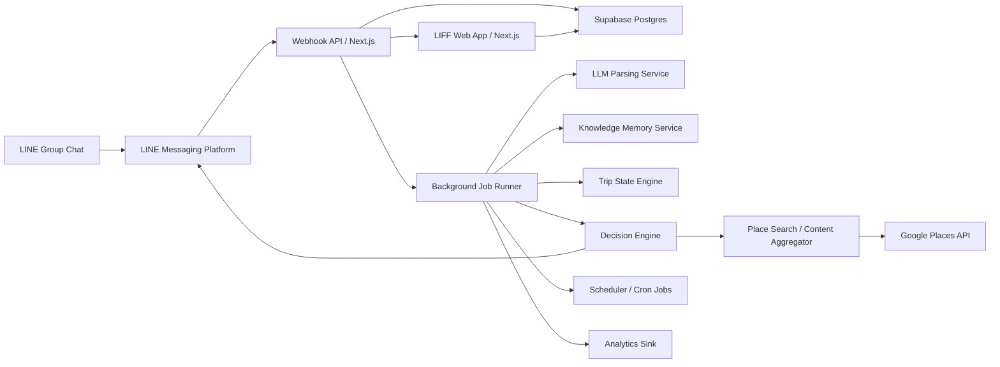

# TravelSync AI MVP System Design

> Version: 1.1  
> Date: 2026-04-10  
> Status: Proposed  
> Source: Derived from `prd-travel-sync-ai-v1.1.md`

---

## 1. Purpose

This document translates the current product requirements into an implementable MVP system design. It focuses on the smallest architecture that can reliably deliver the updated core value loop:

1. Organizer adds the LINE bot to a group.
2. The system parses travel-relevant chat messages.
3. The system stores reusable trip knowledge from chat and shared links.
4. Users retrieve recommendations from remembered group knowledge.
5. The organizer creates an explicit decision item only when the group is ready.
6. Members vote through Flex Messages.
7. The result is persisted and reflected in the LIFF dashboard.

The design optimizes for:

- Fast delivery by a small team
- Low operational complexity
- Correctness and traceability for trip state
- Clear separation between knowledge, planning, and decisions
- Clear upgrade paths as recommendation and planning behavior becomes more capable

---

## 2. Scope

### In Scope for MVP

- LINE bot onboarding and webhook handling
- Semantic parsing of new group messages only
- Durable trip knowledge memory from chat and `/share`
- Three-stage trip board: To-Do, Pending, Confirmed
- Explicit separation between planning items and decision items
- Organizer commands: `/start`, `/add`, `/decide`, `/vote`, `/recommend`, `/status`, `/nudge`, `/help`, `/share`
- Flex Message decision cards with per-user voting
- LIFF dashboard for board, itinerary, votes, help, and expenses
- Scheduled reminders, vote deadline handling, stale-item reminders
- Analytics and operational telemetry

### Out of Scope for MVP

- Native mobile app
- Direct booking or payment processing
- Full itinerary export
- Knowledge editing UI beyond existing operational controls
- Multi-platform chat support outside LINE
- Historical backfill of pre-install group messages

---

## 3. Design Principles

1. Acknowledge LINE fast, process intelligently in the background.
2. Treat structured trip state and trip knowledge as the system of record, not the raw chat transcript.
3. Separate knowledge capture from decision workflows.
4. Only explicit decision items are eligible for voting.
5. Prefer the group's remembered knowledge before external search.
6. Keep the runtime mostly monolithic for speed, but separate concerns internally.
7. Build every user-facing action to degrade gracefully when the LLM or external APIs are slow.

---

## 4. Target Architecture

### 4.1 Logical View



### 4.2 Deployment View

The MVP uses a single Next.js codebase deployed to Vercel with Supabase as the primary state store.

- Next.js app
  - LINE webhook endpoint
  - Bot command handlers
  - LIFF web app pages
  - Internal API routes
- Supabase
  - PostgreSQL database
  - Row-level security and server-side membership checks for LIFF reads and writes
  - Realtime subscriptions where useful for LIFF updates
- Background execution
  - Deferred processing for parsing, knowledge writes, and outbound messages
  - Cron-driven recovery and scheduled jobs for nudges, vote deadlines, and cleanup
- External services
  - LINE Messaging API and LIFF SDK
  - Structured-output LLM provider for semantic parsing
  - Google Places API for fallback option discovery

### 4.3 Why This Shape

This architecture satisfies the main technical tensions in the updated PRD:

- LINE requires webhook acknowledgment in under 1 second.
- LLM parsing and external place lookups cannot be relied on to complete in under 1 second.
- Recommendations should feel grounded in the group's own chat history, not generic search.
- Voting should not be triggered by every saved suggestion.

Therefore:

- The webhook layer validates, records, and acknowledges immediately.
- Background workers process parsing and knowledge updates.
- Knowledge is stored independently of board decisions.
- Decision creation is explicit.
- Voting pulls from knowledge first and search second.

---

## 5. Core Runtime Flows

### 5.1 Group Join and Trip Initialization

1. Bot is added to a LINE group.
2. LINE sends a `join` event to the webhook.
3. Webhook verifies the signature, stores the event, and returns `200 OK` immediately.
4. Background processor creates a `line_group` record if needed.
5. System sends a welcome message with quick-start guidance.
6. Organizer runs `/start Osaka 7/15-7/20`.
7. Command handler creates a `trip` record, sets destination and date range, and confirms setup.

### 5.2 Message Parsing and Knowledge Capture

1. A group message arrives from LINE.
2. Webhook stores a normalized event envelope and acknowledges immediately.
3. Background processor loads current group and active trip context.
4. Relevance filter classifies the message as either travel-relevant or ignorable.
5. If relevant, the parser sends a structured prompt to the LLM.
6. Structured result is validated against schema.
7. Extracted entities are written to `parsed_entities`.
8. Suggested actions are applied:
   - update core trip fields
   - create planning items when action is implied
   - remember places and knowledge when a place mention or shared option is detected
9. Knowledge is deduplicated and enriched in `trip_memories`.
10. Parsing context is updated for future messages and recommendations.

### 5.3 Shared Link to Knowledge

1. User runs `/share [url]`.
2. Bot acknowledges quickly.
3. URL metadata extractor fetches title, type, description, address, ratings, and booking link if possible.
4. Memory service writes or updates a `trip_memories` entry.
5. Bot confirms that the item was saved as trip knowledge.
6. No vote or decision item is created automatically.

### 5.4 Recommendation Flow

1. User runs `/recommend restaurant`.
2. System resolves the active trip.
3. Knowledge retrieval service queries `trip_memories` for matching entries.
4. Results are ranked by mention count, recency, and metadata quality.
5. Bot returns remembered recommendations in chat.
6. If there are no results, the bot suggests natural chat or `/share`.

### 5.5 Decision Creation and Vote Completion

1. Organizer runs `/decide restaurant`.
2. System creates a `trip_item` marked as `item_kind = decision`.
3. Organizer runs `/vote restaurant`.
4. System resolves the matching decision item.
5. Decision engine seeds `trip_item_options` from remembered knowledge for the same trip and item type.
6. If needed, the system falls back to external place search.
7. Flex Message carousel is generated with 3 to 5 options.
8. Decision item moves from `todo` to `pending`.
9. Votes are recorded per member.
10. Vote closes when majority is reached or deadline expires.
11. Winner is written to the item as the confirmed selection.
12. Bot announces the result and the board reflects the confirmed decision.

### 5.6 Reminder Flow

1. Scheduler scans for open votes nearing deadline or stale To-Do items.
2. System computes non-responders or overdue items.
3. Nudge messages are sent only if frequency limits allow.
4. Events are logged for analytics and spam monitoring.

---

## 6. Major Components

### 6.1 Webhook Ingestion Layer

Responsibilities:

- Verify LINE channel signature
- Normalize incoming LINE events
- Persist the event envelope durably
- Return `200 OK` within 1 second
- Trigger async processing

Key decisions:

- Never call the LLM directly in the synchronous webhook path.
- Never depend on external place APIs in the synchronous webhook path.
- Persist first, process second.

Failure handling:

- If async processing does not start, a retry sweeper picks up unprocessed events.
- Duplicate LINE events are deduplicated using the platform event identifier plus group scope.

### 6.2 Command Router

Responsibilities:

- Identify slash commands from message content
- Validate group and organizer context
- Route to command-specific handlers
- Return either immediate response or deferred follow-up

Supported MVP commands:

- `/start`
- `/add`
- `/decide`
- `/vote`
- `/recommend`
- `/status`
- `/nudge`
- `/share`
- `/help`
- `/exp`
- `/exp-summary`

Command strategy:

- Cheap commands like `/help`, `/status`, and `/recommend` should usually complete synchronously.
- Expensive commands like `/share` and `/vote` may acknowledge quickly and then send a follow-up.

### 6.3 Conversation Parsing Service

Responsibilities:

- Filter irrelevant chatter
- Extract travel entities from zh-TW and mixed Chinese-English text
- Resolve references using recent structured context
- Detect contradictions and low-confidence output
- Emit both low-level entities and high-level suggested actions

Pipeline steps:

1. Text normalization
2. Lightweight relevance classification
3. Context assembly from active trip, recent parsed facts, and memory hints
4. LLM structured extraction
5. Confidence scoring and validation
6. Conflict and action-item generation
7. Knowledge write-through when place-like suggestions are detected

Model behavior requirements:

- Output strict JSON
- Return confidence per extracted entity
- Explicitly report `irrelevant` when the message should be ignored
- Prefer no extraction over speculative extraction

MVP simplifications:

- Use recent structured context instead of long raw chat history
- Do not attempt broad multilingual extraction beyond Chinese-English mix
- Do not store full raw message history longer than 7 days

### 6.4 Knowledge Memory Service

Responsibilities:

- Persist durable trip knowledge independently from votes
- Deduplicate repeated place mentions
- Track metadata and mention count
- Provide retrieval for recommendation and decision seeding
- Supply memory hints back into the parsing context

Primary behaviors:

- `rememberPlace` stores or updates a knowledge entry
- `getRecommendations` returns ranked remembered places for chat responses
- `getKnowledgeEntries` supplies decision seeding candidates
- No direct creation of `trip_items` or `trip_item_options` during normal memory writes

### 6.5 Trip State Engine

Responsibilities:

- Maintain authoritative trip, board, and decision state
- Apply state transitions safely
- Distinguish planning items from decision items
- Prevent inconsistent item or vote updates

Primary state model:

- `trip_items.stage`: `todo` -> `pending` -> `confirmed`
- `trip_items.item_kind`: `task` or `decision`

Rules:

- Planning items are not voteable
- Only decision items may move into `pending`
- Only one active vote per decision item
- Organizer override is allowed on unresolved conflicts and tied votes

### 6.6 Decision and Option Service

Responsibilities:

- Validate that votes run only on decision items
- Seed candidates from remembered knowledge first
- Fall back to external search when needed
- Normalize option data and build Flex Message payloads

Inputs:

- Target decision item
- Trip destination and dates
- Remembered knowledge for the same trip and item type
- Budget or preference entities if available

Outputs:

- Ranked option list with name, image, rating, price band, address, and link
- Flex Message payload with vote actions

MVP approach:

- Use `trip_memories` as the primary option source
- Use Google Places as the default fallback source
- Cache metadata where useful

### 6.7 Vote Service

Responsibilities:

- Store one active vote per user per decision
- Allow vote changes until closing
- Determine majority and closure state
- Handle ties and deadline extension

Rules:

- A user can have only one current vote per decision
- A later vote overwrites the earlier vote atomically
- Majority is computed against current participating group size
- If tied at deadline, extend and notify the group or organizer

### 6.8 LIFF Web App

Pages for MVP:

- Dashboard: board grouped by To-Do, Pending, Confirmed
- Votes: pending decision view
- Itinerary: basic confirmed-item timeline and summary
- Expenses: expense tracking and settlement summary
- Help: command summary and product explanation

Responsibilities:

- Authenticate using LIFF and verified LINE identity
- Resolve trip membership server-side
- Show current board, itinerary, votes, and expense state
- Offer fallback refresh and retry states

Design requirements:

- Optimized for the LINE in-app browser
- First meaningful load under 2 seconds on 4G
- Clear distinction between planning items and active decisions

### 6.9 Scheduler and Recovery Jobs

Responsibilities:

- Send stale-item reminders after 48 hours
- Close expired votes
- Trigger tie handling
- Retry failed webhook event processing
- Purge expired raw messages and aged trip data

Job categories:

- Near-real-time retries for failed async event processing
- Time-based user jobs for nudges and deadline enforcement
- Maintenance jobs for retention and cleanup

---

## 7. Data Model

### 7.1 Primary Entities

| Entity | Purpose |
|--------|---------|
| `line_groups` | One LINE group chat connected to the bot |
| `group_members` | Membership snapshot for each group |
| `trips` | Active or historical trip context for a group |
| `trip_items` | Board items across To-Do, Pending, Confirmed |
| `trip_memories` | Durable trip knowledge remembered from chat and shared links |
| `trip_item_options` | Candidate options for a decision item |
| `votes` | Per-user vote records for a decision |
| `parsed_entities` | Structured facts extracted from chat |
| `line_events` | Durable webhook event log and processing status |
| `raw_messages` | Short-retention normalized chat content |
| `analytics_events` | Product telemetry events |

### 7.2 Suggested Schema

#### `line_groups`

- `id` UUID PK
- `line_group_id` text unique
- `name` text nullable
- `status` enum: `active`, `removed`, `archived`
- `created_at` timestamptz
- `last_seen_at` timestamptz

#### `group_members`

- `id` UUID PK
- `group_id` UUID FK
- `line_user_id` text
- `display_name` text nullable
- `role` enum: `organizer`, `member`
- `joined_at` timestamptz
- `left_at` timestamptz nullable
- unique on `(group_id, line_user_id)`

#### `trips`

- `id` UUID PK
- `group_id` UUID FK
- `title` text nullable
- `destination_name` text
- `destination_place_id` text nullable
- `start_date` date nullable
- `end_date` date nullable
- `status` enum: `draft`, `active`, `completed`, `cancelled`
- `created_by_user_id` text
- `created_at` timestamptz
- `ended_at` timestamptz nullable

#### `trip_items`

- `id` UUID PK
- `trip_id` UUID FK
- `item_type` enum: `hotel`, `restaurant`, `activity`, `transport`, `insurance`, `flight`, `other`
- `item_kind` enum: `task`, `decision`
- `title` text
- `description` text nullable
- `stage` enum: `todo`, `pending`, `confirmed`
- `source` enum: `ai`, `command`, `manual`, `system`
- `status_reason` text nullable
- `confirmed_option_id` UUID nullable
- `deadline_at` timestamptz nullable
- `tie_extension_count` integer
- `created_at` timestamptz
- `updated_at` timestamptz

#### `trip_memories`

- `id` UUID PK
- `trip_id` UUID FK
- `group_id` UUID FK
- `item_type` enum aligned with `trip_items.item_type`
- `title` text
- `canonical_key` text
- `summary` text nullable
- `address` text nullable
- `rating` numeric nullable
- `price_level` text nullable
- `image_url` text nullable
- `booking_url` text nullable
- `mention_count` integer
- `source_line_user_id` text nullable
- `source_event_id` text nullable
- `created_at` timestamptz
- `last_mentioned_at` timestamptz
- `updated_at` timestamptz

#### `trip_item_options`

- `id` UUID PK
- `trip_item_id` UUID FK
- `provider` enum: `google_places`, `ota`, `manual`
- `external_ref` text nullable
- `name` text
- `image_url` text nullable
- `rating` numeric nullable
- `price_level` text nullable
- `distance_meters` integer nullable
- `address` text nullable
- `booking_url` text nullable
- `metadata_json` jsonb
- `created_at` timestamptz

#### `votes`

- `id` UUID PK
- `trip_item_id` UUID FK
- `option_id` UUID FK
- `group_id` UUID FK
- `line_user_id` text
- `cast_at` timestamptz
- unique on `(trip_item_id, line_user_id)`

#### `parsed_entities`

- `id` UUID PK
- `group_id` UUID FK
- `trip_id` UUID FK nullable
- `line_event_id` UUID FK
- `entity_type` enum: `date`, `date_range`, `location`, `flight`, `hotel`, `preference`, `budget`, `constraint`, `conflict`, `availability`
- `canonical_value` text
- `display_value` text
- `confidence_score` numeric
- `attributes_json` jsonb
- `created_at` timestamptz

#### `line_events`

- `id` UUID PK
- `line_event_uid` text unique
- `group_id` UUID nullable
- `event_type` text
- `payload_json` jsonb
- `processing_status` enum: `pending`, `processing`, `processed`, `failed`
- `failure_reason` text nullable
- `received_at` timestamptz
- `processed_at` timestamptz nullable
- `retry_count` integer default 0

#### `raw_messages`

- `id` UUID PK
- `line_event_id` UUID FK
- `group_id` UUID FK
- `line_user_id` text
- `message_text` text
- `language_hint` text nullable
- `created_at` timestamptz
- `expires_at` timestamptz

### 7.3 Data Retention Policy

- `raw_messages`: purge after 7 days
- `parsed trip data`: retain until 90 days after trip end
- `trip_memories`: retain with trip data for the active planning lifecycle and limited post-trip period
- `group data after bot removal`: retain for 90 days, then archive or delete
- `analytics events`: retain in aggregated form for long-term reporting

---

## 8. Internal APIs

### 8.1 External-Facing Endpoints

| Endpoint | Method | Purpose |
|---------|--------|---------|
| `/api/line/webhook` | `POST` | Receive LINE events |
| `/api/liff/session` | `GET` | Resolve verified LIFF user and group context |
| `/api/liff/board` | `GET` | Fetch board for a trip |
| `/api/liff/itinerary` | `GET` | Fetch confirmed timeline |
| `/api/liff/items` | `POST` | Create or edit a board item |
| `/api/liff/votes` | `GET`/`POST` | Read pending vote state and cast votes |
| `/api/liff/expenses` | `GET`/`POST` | Expense reads and writes |

### 8.2 Internal Service Contracts

#### Message Parsing Request

```json
{
  "groupId": "uuid",
  "tripId": "uuid",
  "messageId": "uuid",
  "text": "我們7/15-7/20去大阪",
  "recentContext": {
    "destination": null,
    "dateRange": null,
    "openItems": [],
    "memoryHints": []
  }
}
```

#### Message Parsing Result

```json
{
  "relevant": true,
  "entities": [
    {
      "type": "location",
      "canonicalValue": "Osaka",
      "displayValue": "大阪",
      "confidence": 0.97
    }
  ],
  "suggestedActions": [
    {
      "action": "add_option",
      "itemType": "restaurant",
      "optionName": "Some Restaurant"
    }
  ],
  "conflicts": []
}
```

#### Recommendation Response

```json
{
  "itemType": "restaurant",
  "results": [
    {
      "title": "Restaurant A",
      "mentionCount": 3,
      "rating": 4.5,
      "address": "Somewhere"
    }
  ]
}
```

#### Vote Creation Response

```json
{
  "tripItemId": "uuid",
  "itemKind": "decision",
  "stage": "pending",
  "deadlineAt": "2026-04-11T12:00:00Z",
  "seedSource": "trip_memory",
  "options": [
    {
      "optionId": "uuid",
      "name": "Hotel A",
      "rating": 4.5,
      "priceLevel": "$$$",
      "imageUrl": "https://..."
    }
  ]
}
```

---

## 9. State Management and Consistency

### 9.1 Consistency Model

The system can be eventually consistent for message parsing, knowledge capture, and reminder delivery, but must be strongly consistent for:

- trip-item stage transitions
- vote updates
- vote closure and winner confirmation
- authenticated LIFF access control

Use database transactions for:

- moving a decision item from `todo` to `pending`
- recording a vote and replacing a previous vote by the same user
- closing a vote and marking the winning option confirmed

### 9.2 Idempotency

Required for:

- LINE event ingestion
- outbound message retries
- vote close job execution
- knowledge updates from repeated share or parse events
- command processing after client or platform retries

Recommended keys:

- LINE event UID for inbound dedupe
- `trip_id + item_type + canonical_key` for memory dedupe
- `trip_item_id + close_window` for vote closure jobs
- `source_message_id + action_type` for AI-generated side effects

---

## 10. Performance Design

### 10.1 Target Mapping

| Requirement | Design Response |
|------------|-----------------|
| Webhook `< 1s` | Signature verify, persist event, immediate ack |
| Bot commands `< 2s` | Synchronous for cheap commands, async follow-up for expensive commands |
| Parsing `< 3s` | Relevance filter plus structured LLM call with bounded context |
| Recommendation `< 2s` | Query indexed trip memory, avoid external calls by default |
| LIFF load `< 2s` | Compact trip queries and server-side auth resolution |
| 1,000 active groups | Mostly IO-bound architecture with managed DB and stateless app nodes |

### 10.2 Caching Strategy

- Cache memory-derived recommendation results briefly per trip and item type if needed
- Cache place metadata and thumbnails by external place identifier
- Cache rendered image variants for Flex cards
- Avoid caching authoritative vote tallies outside the database

### 10.3 Cost Controls

- Run a cheap relevance filter before the LLM
- Truncate prompt context to recent structured facts and memory hints
- Skip LLM calls for obvious commands and stickers
- Prefer trip memory over external place search
- Cache place search results per destination and item type

---

## 11. Security and Privacy

### 11.1 Authentication and Authorization

- LIFF uses LINE Login and verified token context
- Webhook requests require LINE signature verification
- Protected LIFF APIs require verified trip membership
- Organizer-only operations must verify organizer role
- Never trust client-supplied group IDs or user IDs without server-side resolution

### 11.2 Data Protection

- TLS 1.3 for all transport
- AES-256 at rest through managed platform encryption
- Secrets stored only in environment-backed secret management
- No custom password storage

### 11.3 Privacy Controls

- Raw message storage is temporary and minimal
- Parsed facts and memory are stored at trip and group scope
- `/optout` should exclude future parsing attribution where feasible
- Privacy notice is sent when the bot joins a group

### 11.4 Abuse and Rate Limiting

- Group-level command rate limit: 60 per minute
- User-level command rate limit: 10 per minute
- Cool-down windows per vote and per group for nudges

---

## 12. Reliability and Failure Handling

### 12.1 Failure Modes

| Failure | Design Response |
|--------|-----------------|
| LLM timeout or outage | Queue retry with backoff; do not corrupt trip state |
| Google Places failure | Keep decision item in `todo` and ask the group to share knowledge |
| Duplicate LINE events | Idempotent event ingestion |
| Background processor crash | Retry sweep from `line_events` table |
| LIFF load failure | Retry UI plus text-command fallback |
| Vote close race | DB transaction and item locking |
| Invalid LIFF identity | Deny access and return auth error |

### 12.2 Retry Policy

- Inbound event processing: exponential backoff with bounded retry count
- Outbound LINE sends: retry on transient HTTP failures
- LLM calls: retry only on transient provider failures, not schema-invalid outputs
- Scheduled jobs: idempotent rerun allowed

### 12.3 Recovery Strategy

- Every inbound event is durably recorded before processing
- Failed events remain queryable for support and replay
- Recovery cron retries pending and failed events on a schedule

---

## 13. Observability

### 13.1 Product Analytics

Track the PRD-defined events:

- `bot_added_to_group`
- `trip_created`
- `message_parsed`
- `knowledge_saved`
- `recommendation_requested`
- `decision_item_created`
- `vote_initiated`
- `vote_cast`
- `vote_completed`
- `liff_opened`

### 13.2 Operational Metrics

- Webhook p50, p95, p99 response latency
- Event processing lag
- Parsing success rate and confidence distribution
- Memory write success rate and dedupe rate
- Recommendation latency and hit rate
- Vote completion time
- LIFF page load time
- Outbound message failure rate

### 13.3 Logging

Structured logs should include:

- `request_id`
- `group_id`
- `trip_id`
- `line_event_uid`
- `job_type`
- `provider_name`
- `latency_ms`
- `result`

Do not log secrets, access tokens, or full raw message history beyond operational necessity.

---

## 14. MVP Delivery Plan

### Phase 1: Foundation

- LINE bot registration and webhook verification
- Supabase schema and migrations
- LIFF bootstrap and session resolution
- Basic `/help` and `/start`

### Phase 2: Core State

- Trip and board item CRUD
- Planning item support with `/add`
- Minimal dashboard with three-stage board

### Phase 3: AI Parsing and Knowledge

- Relevance filter
- Structured LLM extraction
- Knowledge memory storage and dedupe
- `/share` and `/recommend`

### Phase 4: Explicit Decisions

- Decision item support with `/decide`
- Decision seeding from trip memory
- Flex Message generation
- Vote capture, tally, and closure

### Phase 5: Automation and Hardening

- Nudges and stale-item reminders
- Retry and recovery jobs
- Analytics instrumentation
- Auth hardening and retention enforcement

---

## 15. Key Risks and Mitigations

| Risk | Impact | Mitigation |
|------|--------|------------|
| LLM parsing is inaccurate in colloquial zh-TW chat | Wrong knowledge or missing facts | Strict schema, confidence thresholds, manual override, future correction UI |
| Memory quality is poor | Weak recommendations and low trust | Deduping, mention counts, metadata enrichment, context tuning |
| Users do not understand planning vs decision items | Confusing workflow | Clear command language, help copy, board labeling |
| Slow external APIs break vote startup | Poor UX | Knowledge-first seeding, async follow-up, fallback messaging |
| Flex card quality is weak on real devices | Low vote participation | Test early on LINE iOS and Android |
| Single app becomes overloaded | Latency and reliability issues | Extract parsing or recommendation workers later without changing DB contract |

---

## 16. Open Questions

1. Should the LIFF dashboard surface trip knowledge directly in MVP, or keep it chat-first for now?
2. How much manual correction should users have over remembered knowledge before a dedicated memory UI exists?
3. Should the system eventually allow AI-suggested decision items based on unresolved planning patterns, while still requiring explicit user confirmation before voting?
4. How should recommendations combine remembered knowledge with constraints like budget, cuisine, area, and schedule in the next iteration?
5. What is the preferred long-term analytics sink as the memory and recommendation layer grows?

---

## 17. Recommended MVP Decision Summary

To ship quickly and satisfy the updated PRD, the MVP should be built as a single Next.js application on Vercel backed by Supabase, with asynchronous event processing to protect the LINE webhook SLA. The core system boundary is no longer just trip state. It is trip state plus reusable trip knowledge.

Every major design choice in this document supports that principle:

- fast webhook ingestion with deferred intelligence
- durable event log and recoverable async processing
- separate relational models for trip items and trip memory
- explicit decision items as the only voting entry point
- knowledge-first recommendations and vote seeding
- lightweight LIFF UI with strong server-side membership checks

This is the smallest design that can credibly deliver the current product promise while leaving a clean path to later expand planning intelligence, recommendation quality, and knowledge editing.
