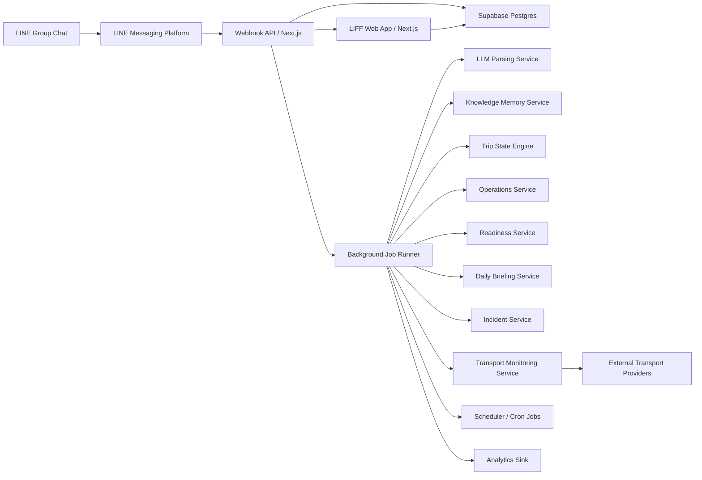

# TravelSync AI System Design

> Version: 1.2  
> Date: 2026-04-10  
> Status: Proposed  
> Source: Derived from `prd-travel-sync-ai-v1.2.md`

---

## 1. Purpose

This document extends the v1.1 system design into the next product version, where TravelSync AI becomes an execution-stage copilot in addition to a planning copilot.

The v1.2 architecture focuses on the smallest practical extension that can reliably deliver this updated value loop:

1. The group plans and confirms core trip decisions.
2. The system generates a pre-departure readiness layer from confirmed trip context.
3. The system produces daily operational summaries during countdown, departure, travel, and return.
4. The system monitors critical transport references for meaningful changes.
5. The system supports structured incident flows when travel disruptions occur.
6. The organizer and members use LIFF and chat to stay aligned during the highest-risk stages of the trip.

The design optimizes for:

- Reusing the existing LINE, LIFF, Supabase, and background job foundation
- Preserving the planning-first architecture from v1.1
- Adding operational state without collapsing everything into generic board items
- Clear degradation when external monitoring or enrichment providers fail
- Incremental delivery by a small team

---

## 2. Scope

### In Scope for v1.2

- Operations command center in LIFF and chat
- Pre-departure readiness checklist generation and management
- Daily briefing generation for departure day, trip days, and return day
- Transport reference storage and monitoring hooks
- Change alert delivery into LINE and LIFF operations views
- Structured incident playbooks and follow-up task generation
- New organizer/member commands: `/ops`, `/ready`, `/brief`, `/incident`
- Analytics and operational telemetry for readiness, alerts, and incidents

### Out of Scope for v1.2

- Direct booking changes or airline self-service actions
- OCR-heavy document ingestion pipelines
- Human concierge escalation
- Full traveler identity verification outside LINE membership
- Native mobile push outside LINE
- Broad country-specific legal or immigration guarantees

---

## 3. Design Principles

1. Preserve the v1.1 knowledge and board model as the planning system of record.
2. Add a separate operational state layer for readiness, live logistics, and incidents.
3. Keep webhook acknowledgment fast and push operational work into background jobs.
4. Make time-sensitive outputs concise, actionable, and phase-aware.
5. Prefer explicit risk visibility over silent assumptions.
6. Treat external monitoring data as advisory and failure-prone.
7. Keep the architecture monolithic in deployment, modular in code.

---

## 4. Target Architecture

### 4.1 Logical View

### 4.2 Deployment View

The v1.2 system remains a single Next.js app deployed to Vercel with Supabase as the primary state store and Vercel cron or equivalent scheduled jobs driving background operational checks.

- Next.js app
  - LINE webhook endpoint
  - Command handlers
  - LIFF dashboard and new operations/readiness pages
  - Internal route handlers for ops and readiness APIs
- Supabase
  - PostgreSQL for trip, board, readiness, alerts, incidents, and monitoring state
  - Row-level security and server-side membership validation
  - Realtime optional for LIFF operational refreshes
- Background execution
  - Readiness generation and recomputation
  - Daily briefing generation
  - Monitoring checks and alert deduplication
  - Incident follow-up task creation
- External services
  - LINE Messaging API and LIFF SDK
  - LLM provider for operational summarization and incident guidance composition
  - Optional transport status providers

### 4.3 Why This Shape

The product tension in v1.2 is different from v1.1:

- Planning data already exists, but execution requires phase-aware orchestration.
- Time-sensitive alerts cannot block request-time flows.
- Operational state should not overload the generic planning board.
- Monitoring and incident support must degrade gracefully when external data is missing.

Therefore:

- We keep planning state where it is.
- We add operational subdomains rather than stretching `trip_items` to model everything.
- We let cron and background workers own recomputation and monitoring.
- We provide lightweight request-time summaries from already-materialized state whenever possible.

---

## 5. Core Runtime Flows

### 5.1 Readiness Generation Flow

1. A trip approaches a configurable departure threshold or the organizer requests `/ready`.
2. The system resolves the active trip, confirmed decisions, parsed entities, and known transport references.
3. The readiness service derives checklist items across categories such as documents, reservations, transport, money, packing, and meetup readiness.
4. Generated items are merged with any existing manually managed readiness items.
5. The system stores unresolved, completed, dismissed, or unknown readiness states.
6. The organizer receives a summary of completion and risk gaps.

### 5.2 Operations Summary Flow

1. A user opens the operations LIFF page or runs `/ops`.
2. The system loads the trip phase, next confirmed items, unresolved readiness items, active alerts, and active incidents.
3. The operations service produces a compact summary model.
4. LIFF renders a structured operations view, while chat returns a concise text summary.

### 5.3 Daily Briefing Flow

1. A scheduled job runs each morning in the trip's local timezone, or the organizer requests `/brief`.
2. The daily briefing service loads itinerary context, transport windows, weather or timing context when available, unresolved readiness gaps, and active incidents.
3. The service composes a short chat briefing and a richer LIFF payload.
4. The chat summary is sent to the LINE group with links or prompts to open LIFF if needed.
5. Delivery and engagement analytics are recorded.

### 5.4 Transport Monitoring Flow

1. The trip stores one or more monitored transport references such as flight numbers.
2. A scheduled monitoring job checks eligible references.
3. The monitoring service normalizes the provider response into an internal status model.
4. The alert engine compares the latest state to the last known state.
5. If a meaningful change occurs, an alert is written, deduplicated, and announced in chat.
6. The operations view updates to show current status and last checked time.

### 5.5 Incident Flow

1. A user runs `/incident [type]` or starts an incident from LIFF.
2. The incident service creates an active incident record with type, trigger source, and current trip context.
3. The service composes a playbook with next steps, relevant bookings or checkpoints, and recommended follow-up actions.
4. If needed, follow-up board or readiness items are created.
5. The organizer can mark the incident resolved or escalated.

---

## 6. Major Components

### 6.1 Operations Service

Responsibilities:

- Compute the live operational summary for chat and LIFF
- Resolve trip phase and next-action priority
- Aggregate readiness, alerts, itinerary milestones, and incidents
- Expose a stable summary model even when subservices partially fail

### 6.2 Readiness Service

Responsibilities:

- Generate structured readiness items from trip state
- Merge system-generated and manual items
- Track lifecycle states such as unresolved, completed, dismissed, and unknown
- Compute completion percent and unresolved critical blockers

### 6.3 Daily Briefing Service

Responsibilities:

- Produce trip-phase-aware daily summaries
- Keep chat output concise and operationally relevant
- Reuse precomputed readiness and operations state where possible
- Support both scheduled and on-demand generation

### 6.4 Transport Monitoring Service

Responsibilities:

- Store monitored transport references
- Poll providers on a schedule
- Normalize provider payloads to an internal status model
- Detect meaningful status changes
- Trigger deduplicated alerts

### 6.5 Incident Service

Responsibilities:

- Create and manage incident records
- Provide incident-type-specific next steps
- Attach relevant trip context and links
- Generate follow-up actions and resolution logs

### 6.6 LIFF Operations Experience

New pages for v1.2:

- Operations: live overview and alerts
- Readiness: checklist progress and unresolved items

### 6.7 Scheduler and Jobs

New scheduled responsibilities:

- readiness recomputation
- daily briefing generation
- transport status monitoring
- unresolved readiness nudges
- active incident follow-up checks

---

## 7. Data Model Extensions

The existing v1.1 schema remains the base. v1.2 adds operational tables instead of overloading the original planning schema.

### 7.1 Proposed New Tables

- `trip_readiness_items`
- `trip_member_statuses`
- `trip_transport_monitors`
- `trip_transport_alerts`
- `trip_incidents`
- `trip_incident_events`
- `trip_daily_briefings`

### 7.2 Proposed Key Fields

`trip_readiness_items`

- `trip_id`
- `category`
- `title`
- `description`
- `severity`
- `status`
- `scope`
- `assignee_line_user_id`
- `source_kind`
- `source_ref`
- `due_at`
- `completed_at`

`trip_transport_monitors`

- `trip_id`
- `transport_type`
- `provider`
- `reference_code`
- `scheduled_departure_at`
- `origin_code`
- `destination_code`
- `monitoring_status`
- `last_checked_at`
- `last_payload_json`

`trip_transport_alerts`

- `trip_id`
- `monitor_id`
- `alert_type`
- `severity`
- `message`
- `dedupe_key`
- `detected_at`
- `sent_at`

`trip_incidents`

- `trip_id`
- `incident_type`
- `status`
- `severity`
- `started_by_line_user_id`
- `summary`
- `context_json`
- `resolved_at`

### 7.3 Migration Strategy

1. Add new operational tables with no breaking changes.
2. Keep all existing v1.1 board and memory flows unchanged.
3. Backfill nothing by default.
4. Generate readiness and monitoring state lazily when a trip becomes eligible or a command is used.

---

## 8. API and Command Surface

### 8.1 New Commands

- `/ops`
- `/ready`
- `/brief`
- `/incident [type]`

### 8.2 New LIFF APIs

- `GET /api/liff/operations`
- `GET /api/liff/readiness`
- `POST /api/liff/readiness`
- `POST /api/liff/incidents`

### 8.3 New Cron Entrypoints

- `POST /api/cron/readiness-refresh`
- `POST /api/cron/daily-briefings`
- `POST /api/cron/transport-monitor`
- `POST /api/cron/incident-followups`

---

## 9. Reliability and Failure Handling

### 9.1 Domain-level fallbacks

- If readiness generation fails, preserve prior items and mark recomputation as degraded.
- If transport monitoring fails, keep the last known state and surface freshness indicators.
- If LLM summarization fails for daily briefings, fall back to deterministic summaries from stored data.
- If incident enrichment fails, return the base incident playbook without optional context.
- If alert delivery fails, keep the alert persisted for retry and LIFF visibility.

### 9.2 LINE event processing — durable queue

The `line_events` table is the durable queue; the webhook is the producer; `after()` is the fast-path consumer; `app/api/cron/process-events` is the recovery sweeper. No external queue library is used.

- **Producer (webhook).** `app/api/line/webhook/route.ts` persists every event with `processing_status='pending'` before returning 200 OK. Idempotency is enforced by the `line_event_uid` unique constraint, so LINE retries cannot double-process.
- **Fast-path consumer.** Next.js `after()` hands the persisted event to `processLineEvent`. On success the row is marked `processed`; on exception it is marked `failed` and a backoff timestamp is written.
- **Recovery sweeper.** The hourly `process-events` cron picks up rows in three states:
  1. `pending` — `after()` never started or crashed before marking.
  2. `processing` older than 5 minutes — worker died mid-flight; the row would otherwise leak forever.
  3. `failed` with `retry_count < 5` and `next_retry_at` elapsed — honors backoff so poison messages don't thrash the LLM and Sentry.
- **Backoff.** `computeNextRetryAt(retry_count)` returns `2^(retry_count+1)` seconds out, capped at 1 hour. Mirrors the `outbound_messages` pattern.
- **Atomic re-pickup.** The cron calls the `increment_retry_count` RPC before reprocessing so a second worker cannot double-process the same row.
- **Reply-token caveat.** Retried events lose their reply-token freshness (LINE's reply window is short). Handlers reached via the cron path must use `pushText`/`pushFlex`, not `replyText`/`replyFlex`. This is enforced by convention; consider a lint or runtime guard if violations recur.

### 9.3 Outbound delivery

`lib/line.ts` is the only runtime caller of `@line/bot-sdk`. Every push is tracked in `outbound_messages` with `next_retry_at` exponential backoff; the same `process-events` cron drains the failed-outbound queue alongside failed events.

---

## 10. Security Considerations

- LIFF access remains gated by verified LINE membership and active group scope.
- Sensitive operational details should be minimized in public group chat responses.
- Provider credentials and transport APIs remain server-side only.
- Incident and readiness audit trails should be immutable enough for debugging and support.

---

## 11. Delivery Plan

### Phase 1

- schema scaffolding
- readiness service
- `/ready` command
- readiness LIFF page

### Phase 2

- operations summary service
- `/ops` command
- operations LIFF page
- daily briefing generation

### Phase 3

- transport monitor storage
- scheduled monitoring jobs
- alert dedupe and LINE announcements

### Phase 4

- incident service
- `/incident` command
- follow-up action generation

This order intentionally delivers value before the hardest provider integrations land.
